#Book Recommendation APP 

##App Description:
- Bookish is an iOS app developed in Swift that helps users explore and manage their reading journey with ease. Whether you're searching by title, author, or genre, Bookish provides detailed book information including ratings, genres, and release dates. Users can categorize books into Current Read, Wish List, and Have Read, and enjoy a clean, user-friendly interface with smooth tab navigation.

🔑 Key Features:

    🔍 Search books by title or author

    📖 Detailed Book Info with genre, ratings, and description

    🗂️ Track Reading Status – Current Read, Wish List, Have Read

    🎯 Genre Filtering to explore by category

    👤 User Account system with sign-up, sign-in, and profile settings

# Language : 
- Swift

# App overview:  

|----------------|----------------|----------------|----------------|
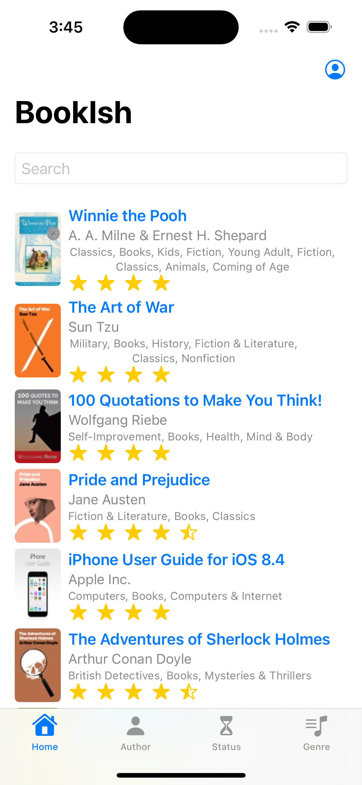 | 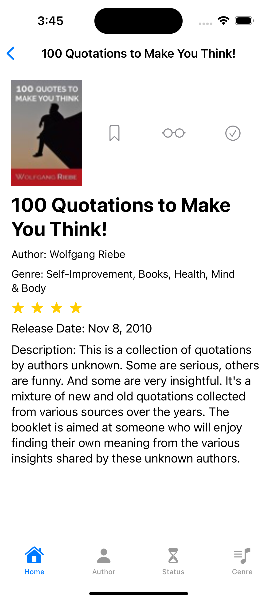 | 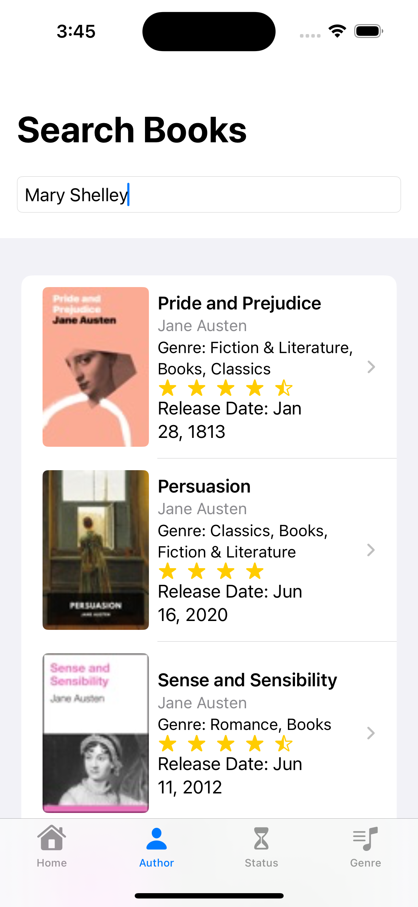 | 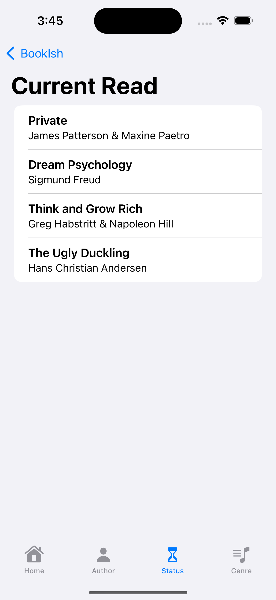 
|----------------|----------------|----------------|----------------|
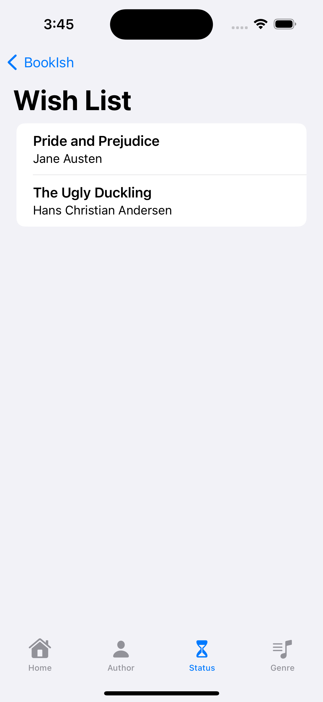 | 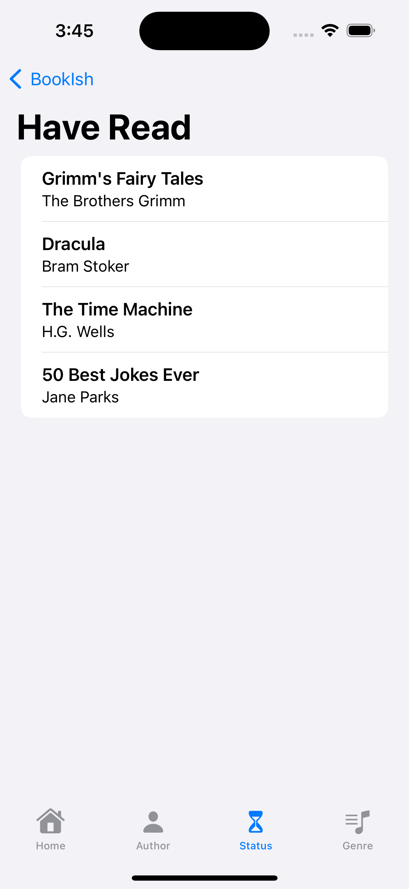 | 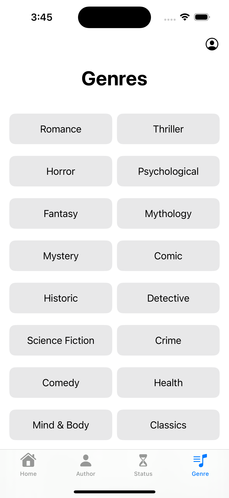 | 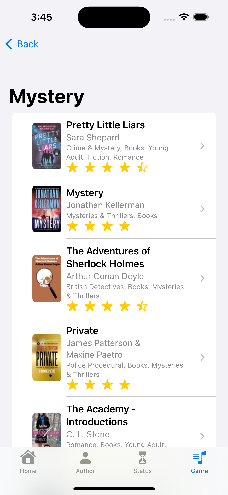 
|----------------|----------------|----------------|----------------|
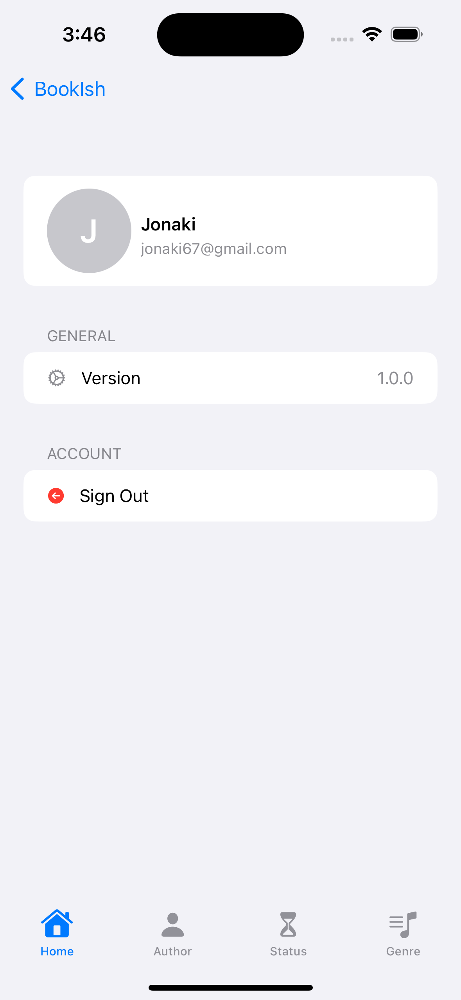 | 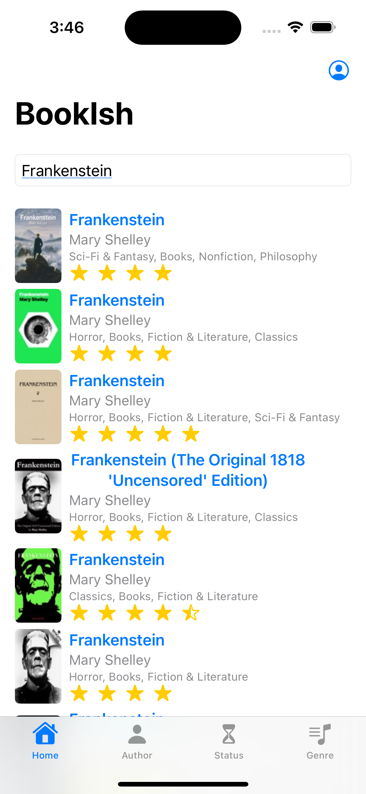 | 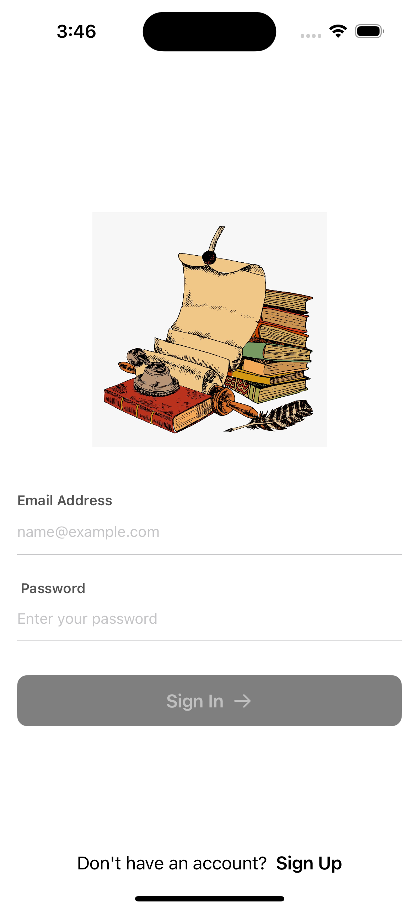 | 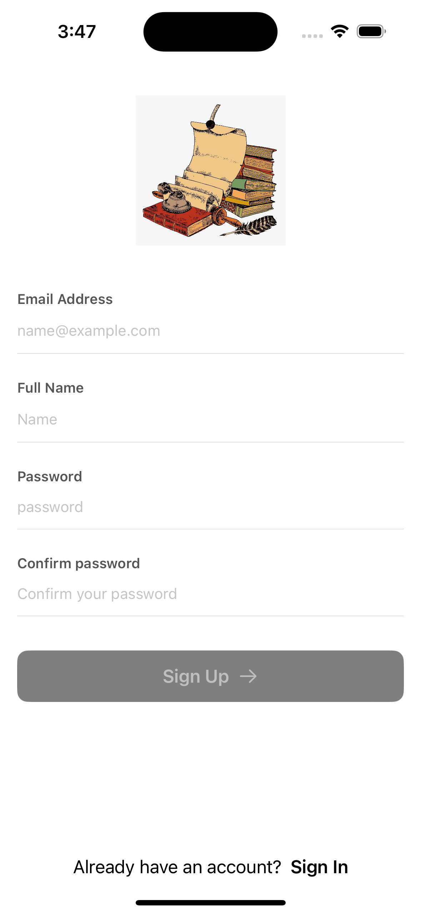 

